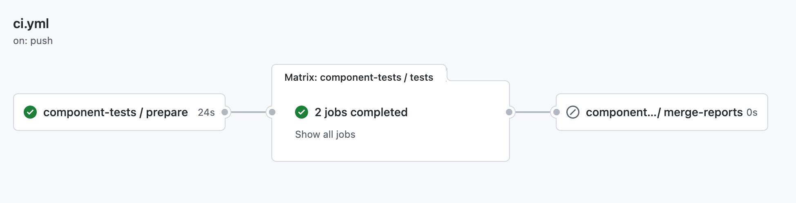
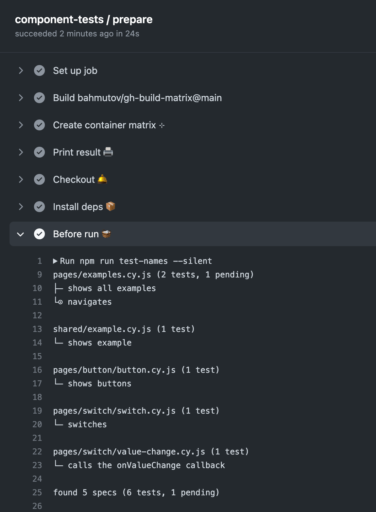
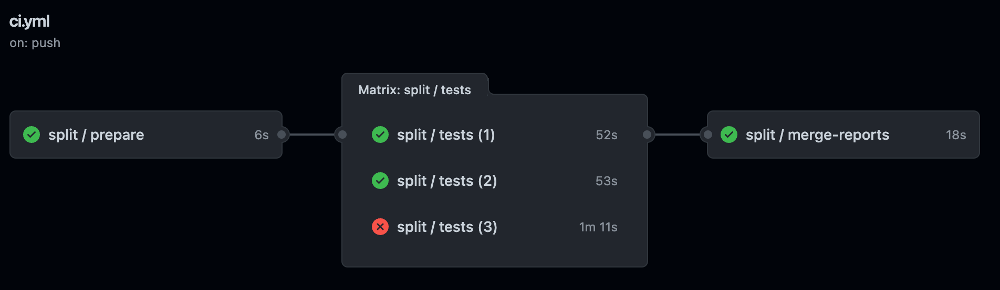
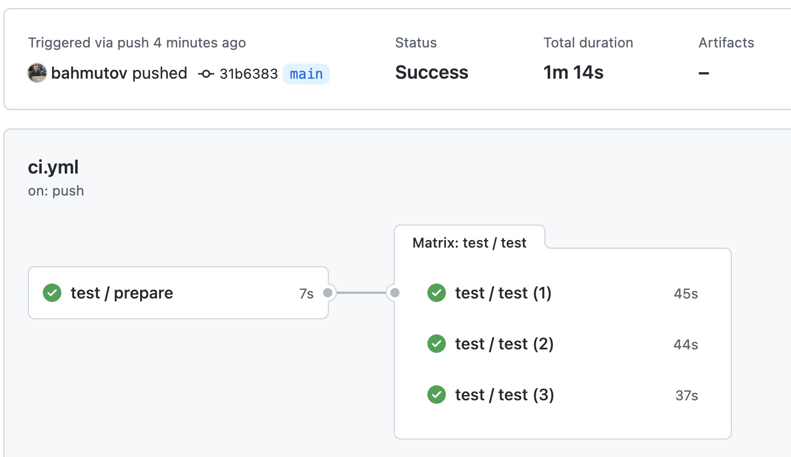

# cypress-workflows
> Reusable Cypress workflows for GitHub Actions

Call these workflows from your GitHub Action workflows, a single line (with parameters) let's you run N parallel test jobs without any configuration.

## Example

Check out the source code, install and cache dependencies, and run all Cypress specs using the following workflow, store the `cypress/screenshots`, `cypress/videos`, and `cypress/results` artifacts.

```yml
name: ci
on: [push]
jobs:
  test:
    # use the reusable workflow to check out the code, install dependencies
    # and run the Cypress tests
    # https://github.com/bahmutov/cypress-workflows
    uses: bahmutov/cypress-workflows/.github/workflows/standard.yml@v1
```

### store-artifacts

default `true`. Stores the test run artifacts.

## Record the run

To record the test run on the Cypress Dashboard, pass the options to the workflow and the record key as a secret

```yml
name: ci
on: [push]
jobs:
  test:
    # use the reusable workflow to check out the code, install dependencies
    # and run the Cypress tests
    # https://github.com/bahmutov/cypress-workflows
    uses: bahmutov/cypress-workflows/.github/workflows/standard.yml@v1
    with:
      record: true
    secrets:
      recordKey: ${{ secrets.CYPRESS_RECORD_KEY }}
```

## Split example

Let's split all specs across 3 machines using [cypress-split](https://github.com/bahmutov/cypress-split) plugin. Configure the plugin using its documentation, then use this workflow:

```yml
name: ci
on: [push]
jobs:
  test:
    # https://github.com/bahmutov/cypress-workflows
    uses: bahmutov/cypress-workflows/.github/workflows/split.yml@v1
    with:
      n: 3
```

Sometimes you might want to run a single command before all split jobs start. You can use `before-run` parameter. See [rn-examples](https://github.com/bahmutov/rn-examples)

```yml
name: ci
on: push
jobs:
  component-tests:
    # https://github.com/bahmutov/cypress-workflows
    uses: bahmutov/cypress-workflows/.github/workflows/split.yml@v1
    with:
      # print the test names
      before-run: 'npm run test-names --silent'
      component: true
      n: 2
```



If you click on the "prepare" job, the `before-run` step prints the test names



### marge

Combines all separate Mochawesome JSON reports into a single HTML report including screenshots and videos.

```yml
# https://github.com/bahmutov/cypress-workflows
uses: bahmutov/cypress-workflows/.github/workflows/split.yml@v1
with:
  n: 3
  marge: true
```

Assumes the project has installed `mochawesome`, `mochawesome-merge`, and `mochawesome-report-generator` dependencies.

```js cypress.config.js
import { defineConfig } from 'cypress'
export default defineConfig({
  // https://github.com/adamgruber/mochawesome
  reporter: 'mochawesome',
  reporterOptions: {
    useInlineDiffs: true,
    embeddedScreenshots: true,
    reportDir: 'cypress/results',
    reportFilename: '[name].html',
    overwrite: true,
    html: true,
    json: true,
  }
})
```

See the example in [bahmutov/cy-report-example](https://github.com/bahmutov/cy-report-example) and read the blog post [The Battle of Cypress Mochawesome Reporters](https://glebbahmutov.com/blog/the-awesome-battle/).



## Parallel example

Let's split all tests across 3 machines using [Cypress Parallelization](https://on.cypress.io/parallelization) paid feature.

```yml
name: ci
on: [push]
jobs:
  test:
    # https://github.com/bahmutov/cypress-workflows
    uses: bahmutov/cypress-workflows/.github/workflows/parallel.yml@v1
    with:
      n: 3
    secrets:
      recordKey: ${{ secrets.CYPRESS_RECORD_KEY }}
```

Result:



## Workflows

- [standard.yml](./.github/workflows/standard.yml) checks out code, installs dependencies, and runs tests on a single machine
- [split.yml](./.github/workflows/split.yml) checks out the coe, installs dependencies, splits specs per machine using [cypress-split](https://github.com/bahmutov/cypress-split) plugin.
- [parallel.yml](./.github/workflows/parallel.yml) lets you specify the number if test machines to use. Splits specs using Cypress Dashboard

The workflows allow passing pretty much all [Cypress GH Action](https://github.com/cypress-io/github-action) parameters, see the individual workflow YML file.

## Versions

Advice: use an explicit [release tag](https://github.com/bahmutov/cypress-workflows/releases) when using a workflow like `parallel.yml@v1.0.1`. You might also use the latest release from the major branch `v1` like `parallel.yml@v1`. Not recommended: using the latest commit on the branch `parallel.yml@main` or using a specific commit `parallel.yml@2a9d460`.

## Examples

- [bahmutov/cypress-workflows-example](https://github.com/bahmutov/cypress-workflows-example) shows how to use the standard and the parallel workflows
- [cypress-3rd-party-script-example](https://github.com/bahmutov/cypress-3rd-party-script-example) shows how to run the end-to-end tests using the standard workflow before deploying the site
- [cypress-wordle](https://github.com/bahmutov/cypress-wordle)
- [react-app-actions](https://github.com/bahmutov/react-app-actions) shows how to run the tests using a workflow and then release a new version using semantic release step
- [bahmutov/cypress-recurse](https://github.com/bahmutov/cypress-recurse)
- [bahmutov/my-svelte-app](https://github.com/bahmutov/my-svelte-app)
- [bahmutov/sudoku-testing-v10](https://github.com/bahmutov/sudoku-testing-v10) runs E2E and component tests using Cypress v10

## Debugging

### debug-inputs

You can print the workflow inputs using the parameter `debug-inputs`, for example

```yml
uses: bahmutov/cypress-workflows/.github/workflows/standard.yml@v1
with:
  debug-inputs: true
```

Should print something like

```
Debug inputs 🐞
{
  "record": false,
  "config": false,
  "config-file": "",
  "envs": "grepTags=@nightly",
  ...
  "quiet": false,
  "debug-inputs": true
}
```

### debug variable

You can set the environment variable `DEBUG` to enable verbose output from the [debug](https://github.com/debug-js/debug#readme) module, often used by Cypress and its plugins.

```yml
uses: bahmutov/cypress-workflows/.github/workflows/standard.yml@v1
with:
  debug: cy-grep
```

Should print something like:

```
cy-grep cy-grep plugin version 1.3.1 +0ms
cy-grep Cypress config env object: { grepFilterSpecs: true, grepOmitFiltered: true, CACHE_FOLDER: '/home/runner/.cache/Cypress' } +1ms
cy-grep specPattern cypress/e2e/**/*.cy.{js,jsx,ts,tsx} +2ms
cy-grep excludeSpecPattern *.hot-update.js +0ms
```

## Small print

Author: Gleb Bahmutov &lt;gleb.bahmutov@gmail.com&gt; &copy; 2021

- [@bahmutov](https://twitter.com/bahmutov)
- [glebbahmutov.com](https://glebbahmutov.com)
- [blog](https://glebbahmutov.com/blog)
- [videos](https://www.youtube.com/glebbahmutov)
- [presentations](https://slides.com/bahmutov)
- [cypress.tips](https://cypress.tips)

License: MIT - do anything with the code, but don't blame me if it does not work.

Support: if you find any problems with this module, email / tweet /
[open issue](https://github.com/bahmutov/cypress-workflows/issues) on Github

## MIT License

Copyright (c) 2021 Gleb Bahmutov &lt;gleb.bahmutov@gmail.com&gt;

Permission is hereby granted, free of charge, to any person
obtaining a copy of this software and associated documentation
files (the "Software"), to deal in the Software without
restriction, including without limitation the rights to use,
copy, modify, merge, publish, distribute, sublicense, and/or sell
copies of the Software, and to permit persons to whom the
Software is furnished to do so, subject to the following
conditions:

The above copyright notice and this permission notice shall be
included in all copies or substantial portions of the Software.

THE SOFTWARE IS PROVIDED "AS IS", WITHOUT WARRANTY OF ANY KIND,
EXPRESS OR IMPLIED, INCLUDING BUT NOT LIMITED TO THE WARRANTIES
OF MERCHANTABILITY, FITNESS FOR A PARTICULAR PURPOSE AND
NONINFRINGEMENT. IN NO EVENT SHALL THE AUTHORS OR COPYRIGHT
HOLDERS BE LIABLE FOR ANY CLAIM, DAMAGES OR OTHER LIABILITY,
WHETHER IN AN ACTION OF CONTRACT, TORT OR OTHERWISE, ARISING
FROM, OUT OF OR IN CONNECTION WITH THE SOFTWARE OR THE USE OR
OTHER DEALINGS IN THE SOFTWARE.
